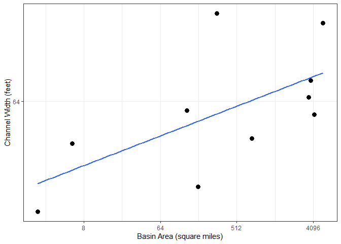

``` r
library(ggplot2)
library(knitr)
```

## GitHub Documents

This is an R Markdown format used for publishing markdown documents to
GitHub. When you click the **Knit** button all R code chunks are run and
a markdown file (.md) suitable for publishing to GitHub is generated.

## Including Code

You can include R code in the document as follows:

``` r
stream_stats<-read.csv("D://GEOG_4300/1111111.csv")


  colnames(stream_stats)[colnames(stream_stats)=="Name.of.Channel"] <- "Coordinates"
```

``` r
ggplot(stream_stats, aes(x=Basin.area, y=Channel.Width))+
  geom_point(size=3)+
  theme_bw()+
  labs(x="Basin Area (square miles)", y="Channel Width (feet)")+
  geom_smooth(method = lm, se = FALSE, )
```

<!-- -->

``` r
kable(stream_stats)
```

| Coordinates         | Channel.Width | Basin.area | Channel.Width.1 |
| :------------------ | ------------: | ---------: | --------------: |
| 34.17638, -83.53276 |            43 |       2.28 |              43 |
| 34.15599, -83.52073 |            55 |       5.78 |              55 |
| 34.11774, -83.47988 |            62 |     131.00 |              62 |
| 34.07323, -83.46202 |            47 |     178.00 |              47 |
| 33.92559, -83.36555 |            88 |     296.00 |              88 |
| 33.87394, -83.33857 |            56 |     774.00 |              56 |
| 32.83743, -82.97276 |            65 |    3600.00 |              65 |
| 32.81002, -82.96238 |            69 |    3830.00 |              69 |
| 32.65480, -82.93429 |            61 |    4210.00 |              61 |
| 31.96116, -82.54200 |            85 |    5330.00 |              85 |

## Including Plots

You can also embed plots, for example:

<!-- -->

Note that the `echo = FALSE` parameter was added to the code chunk to
prevent printing of the R code that generated the plot.
